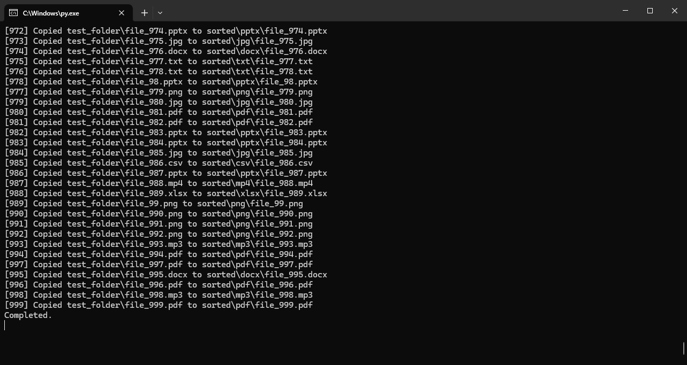
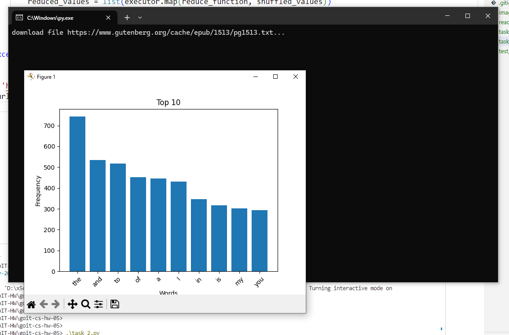

# Task 1

Напишіть Python-скрипт, який буде читати всі файли у вказаній користувачем вихідній папці (source folder) і розподіляти їх по підпапках у директорії призначення (output folder) на основі розширення файлів. Скрипт повинен виконувати сортування асинхронно для більш ефективної обробки великої кількості файлів.

```python

# create dummy files
.\test_1.py

# run main program
.\task_1.py -s test_folder -d sorted

```




# Task 2

Напишіть Python-скрипт, який завантажує текст із заданої URL-адреси, аналізує частоту використання слів у тексті за допомогою парадигми MapReduce і візуалізує топ-слова з найвищою частотою використання у тексті.



